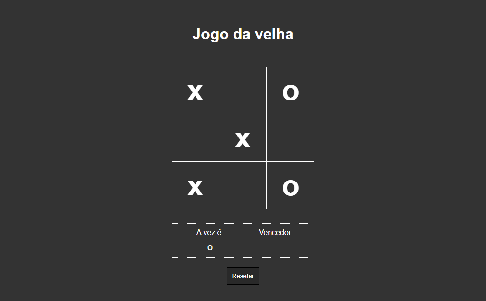

# Jogo da Velha

> Jogo

Esse é o projeto Jogo da Velha criado durante o curso de JavaScript da B7Web.

[Clique para acessar](https://guimiiller.github.io/jogo_da_velha/)

## 🚀 Tecnologias

- HTML
- CSS
- JavaScript
- Git e Github

## 💻 O que aprendi

- Aprendi a manipular a variável e renderizar o que tem nelas
- Criar uma função para verificar as sequências que o jogador tem que ter para vencer

## 📨 Contato

- guilhermemillerblack@gmail.com